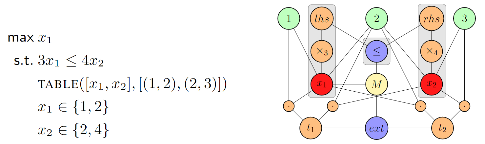

# Graph-Representation
This repo contains experiments related to the representation of combinatorial optimization problems as (heterogeneous) graphs. We include all the code related to the implementations of 4 problem-specific representations, as well as our generic model and our XCSP3 parser. 

The problem-specific models are the following:
- [NeuroSAT](https://arxiv.org/abs/1802.03685) : a GNN trained to predict whether a given SAT problem is solvable or not- and an attempt to model SAT problems with a generic graph representation. 
- [TSP-GNN](https://arxiv.org/abs/1809.02721) : a GNN trained to predict the decision variant of a TSP.
- [GC-GNN](https://arxiv.org/abs/1903.04598) : a GNN trained to predict the decision variant of a Graph coloring problem.
- [KS-GNN](https://link.springer.com/chapter/10.1007/978-3-030-58475-7_51) : a GNN trained to predict the decision variant of a Knapsack problem.

The generic graph representation is intended to be used to model any combinatorial optimization as a graph.

## Our heterogeneous graph representation

Formally, a combinatorial problem $\mathcal{P}$ is defined as a tuple $\langle X, D(X), C, O \rangle$, where $X$ is the set
of variables, $D(X)$ is the set of domains, $C$ is the set of constraints, and $O$ ($X \to \mathbb{R}$) is an objective function. A valid solution is an assignment of each variable to a value of its domain such that every constraint is satisfied. The optimal solution is a valid solution such that no other solution has a better value for the objective.

Our goal is to build a function $\Phi: \langle X, D(X), C, O \rangle \mapsto \mathcal{G}(V,E)$, where $\mathcal{G}$ is a graph and $V$, $E$ are its vertex and arc sets, respectively. We want this function to be *injective*, i.e., an encoding refers to at most one combinatorial problem. We propose to do so by introducing an encoding consisting in a heterogeneous and undirected graph featuring 5 types of vertices: *variables*, *constraints*, *values*, *operators*, and *model*. The core idea is to split each constraint as a sequence of elementary operations, to merge vertices representing the same variable or value, and connect together all the relationships. An illustration of an encoding is proposed in Figure~\ref{fig:encoding}. Intuitively, this process is similar to building the abstract syntax tree of a program. Formally, the encoding gives a graph 
$$\mathcal{G}(V_{var, cst, val, ope, mod}, f_{var, cst, val, ope, mod}, E)$$ with the five types of vertices, and specific features attached to each vertex. Each type is defined as follows.

### Node Types

#### Values ($V_{val}$)

A *value-vertex* is introduced for each constant appearing in $\mathcal{P}$. Such values can appear inside either a domain or a constraint. All the values are distinct, i.e., they are represented by a unique vertex. The type of the value (integer, real, etc.) is added as a feature ($f_{val}$) to each *value-vertex*, using a one-hot encoding.

#### Variables ($V_{var}$)

A *variable-vertex* is introduced for each variable appearing in $\mathcal{P}$. A vertex related to a variable $x \in X$ is connected through an edge to each value $v$ inside the domain $D(x)$. Such as the *value-vertices*, all variables are represented by a unique vertex. The type of the variable (boolean, integer, set, etc.) is added as a feature ($f_{var}$) using a one-hot encoding.

#### Constraints ($V_{cst}$)

A *constraint-vertex* is introduced for each constraint appearing in $\mathcal{P}$. A vertex related to a constraint $c \in C$ is connected through an edge to each value $v$ that is present in the constraint. The type of the constraint (*inequality*, *allDifferent*, *table*, etc.) is added as a feature ($f_{cst}$) using a one-hot encoding.

#### Operators ($V_{ope}$)

Tightly related to constraints, *operator-vertices* are used to unveil the combinatorial structure of constraints. Operators represent modifications or restrictions on variables involved in constraints (e.g., arithmetic operators, logical operators, views, etc.). An *operator-vertex* is added each time a variable $x \in X$ is modified by such operations. The vertex is connected to the vertices related to the impacted variables. The type of the operator (+, $\times$, $\land$, $\lor$, etc.) is added as a feature ($f_{ope}$) using a one-hot encoding. If the operator uses a numerical value to modify a variable, this value is used as a feature ($f_{ope}$) as well.

#### Model ($V_{mod}$)

There is only one *model-vertex* per graph. This vertex is connected to all *constraint-vertices* and all *variable-vertices* involved in the objective function. Its semantics is to gather additional information about the combinatorial problem (e.g., the direction of the optimization) by means of its feature vector ($f_{mod}$).


<p align="center">
  
</p>


#### Example

There are $3$ *value-vertices* depicted in the encoding the problem above (in green) and $2$ *variable-vertices* (in red). As $x_1$ contains values $1$ and $2$ in its domain, they are connected with an edge, and similarly for the domain of $x_2$. There are $2$ *constraint-vertices* (in blue), one for the inequality ($\leq$) and one for the table constraint ($\textsf{ext}$). The gray area in the figure shows how the constraint $3x_1 \leq 4x_2$ is scattered with operators (in orange). Specifically, it involves a multiplication ($\times$, with feature $3$) of $x_1$ on the right-side ($\textsf{rhs}$) and a multiplication ($\times$, with feature $4$) of $x_2$ on the left-side ($\textsf{lhs}$). The outer operators are then connected to the related constraint, e.g.,  $\textsf{rhs}$ and $\textsf{lhs}$ for the inequality ($\leq$). The constraint $table([x_1,x_2],[(1,2),(2,3)])$ is expressed in a similar way. It involves two tuples $t_1$ and $t_2$. Finally,  the *model-vertex* (in yellow) is connected to the two constraints, and to variable $x_1$, as it is part of the objective function.


## Structure 

The repo is structured as follows:
```
src
├── __init__.py
├── generic_xcsp
│   ├── __init__.py
│   ├── alldifferent.py
│   ├── constraints
│   ├── constraints.py
│   ├── dataset.py
│   ├── element.py
│   ├── generic_model.py
│   ├── graph_builder.py
│   ├── instance.py
│   ├── intension_utils.py
│   ├── sum_constraint.py
│   ├── training_config.py
│   └── variable_parsing.py
├── models
│   ├── __init__.py
│   ├── common
│   │   ├── __init__.py
│   │   ├── config.py
│   │   ├── lstm_conv.py
│   │   ├── pytorch_lr_scheduler.py
│   │   ├── pytorch_models.py
│   │   ├── pytorch_utilities.py
│   │   └── training_utils.py
│   ├── decision_tsp
│   │   ├── __init__.py
│   │   ├── base_model.py
│   │   ├── config.py
│   │   ├── dataset.py
│   │   ├── generic_model.py
│   │   ├── instance_generator.py
│   │   ├── instance_parser.py
│   │   ├── plotting_utils.py
│   │   ├── setup.md
│   │   ├── xml_element_generator.py
│   │   └── xml_extension_generator.py
│   ├── graph_coloring
│   │   ├── __init__.py
│   │   ├── base_model.py
│   │   ├── config.py
│   │   ├── dataset.py
│   │   ├── gc_parser.py
│   │   ├── graph_coloring_instances
│   │   ├── instance_generator.py
│   │   ├── rename_graphs.py
│   │   └── xml_generator.py
│   ├── knapsack
│   │   ├── instance_generator.py
│   │   └── knapsack_model.py
│   └── sat
│       ├── __init__.py
│       ├── config.py
│       ├── dataset.py
│       ├── neurosat_model.py
│       ├── plotting_utils.py
│       ├── sat_parser.py
│       ├── scripts
│       │   ├── PyMiniSolvers
│       │   ├── gen_sr_dimacs.py
│       │   ├── generate_data.sh
│       │   └── setup.sh
├── build_marty_et_al_datasets.py
├── requirements.txt
├── test_generic_model.py
├── test_graph_coloring.py
├── test_knapsack_specific_model.py
├── test_sat.py
├── test_tsp.py
├── train_generic_model.py
├── train_graph_coloring.py
├── train_knapsack_specific_model.py
├── train_sat.py
├── train_tsp.py
└── utils
    └── lzma_utils.py
```

The `src/models` subdirectory contains problem-specific models, instance generators and related utilities, while the generic stuff in in the `src/generic_xcsp` subdirectory. The `src/utils` subdirectory contains utilities for compressing and decompressing lzma files.

## Setup
As usual, start by creating a virtual environment and installing the requirements. We will describe the setup to generate data for all different problems. Please note that, for the problem-specific models, as well as the generic models, you will need 2 directories to store your data: `raw` and `processed`. The `raw` directory will contain the raw data, while the `processed` directory will contain the data after it has been processed and converted to PyTorch-Geometric objects.

### SAT

The SAT model and instance generator are based on the [NeuroSAT](https://arxiv.org/abs/1802.03685). To complete the setup, cd into `src/models/sat` and run `setup.sh`. To generate instances, cd into `src/models/sat` and run `./generate_data.sh`. 

### TSP
The TSP instance generator setup is a little tedious. It uses pyconcorde - a pytorch wrapper for the concorde TSP solver. The setup is described in the following section.

#### QSopt
Concorde requires a linear programming solver. In this setup, we use QSopt. Simply download it (all three files) from (this link)[https://www.math.uwaterloo.ca/~bico/qsopt/downloads/downloads.htm]. I am using ubuntu, so I download all 3 files located at the bottom of the page and I place them in a directory named `qsopt_solver`. 

#### Concorde Download, Installation and Setup
```
sudo apt update
sudo apt install build-essential libgmp-dev libgsl-dev
wget http://www.math.uwaterloo.ca/tsp/concorde/downloads/codes/src/co031219.tgz
tar -xvf co031219.tgz
cd concorde
./configure --prefix=/usr/local --with-qsopt=[full_path_to_qsopt_solver_directory]
make
export PATH="/usr/local/concorde/TSP:$PATH
```
Adjust the last line according to where you downloaded the concorde solver. Following this step by step will allow you to use concorde. This can be tested by running the following command:
```
concorde -s 99 -k 100
```
Running this command should yield the following:

```
concorde -s 99 -k 100
Host: [host_name]  Current process id: xxxx
Using random seed 99
Random 100 point set
XSet initial upperbound to 780 (from tour)
  LP Value  1: 738.500000  (0.00 seconds)
  LP Value  2: 765.000000  (0.02 seconds)
  LP Value  3: 774.660000  (0.05 seconds)
  LP Value  4: 778.000000  (0.09 seconds)
  LP Value  5: 778.465517  (0.13 seconds)
  LP Value  6: 778.705882  (0.16 seconds)
  LP Value  7: 779.538462  (0.20 seconds)
  LP Value  8: 779.937500  (0.24 seconds)
  LP Value  9: 780.000000  (0.26 seconds)
New lower bound: 780.000000
Final lower bound 780.000000, upper bound 780.000000
Exact lower bound: 780.000000
DIFF: 0.000000
Final LP has 180 rows, 336 columns, 2921 nonzeros
Optimal Solution: 780.00
Number of bbnodes: 1
Total Running Time: 0.45 (seconds)
```

#### Installing pyconcorde
pyconcorde is a python wrapper for the concorde TSP solver. It can be installed by running the following commands:
```
git clone https://github.com/jvkersch/pyconcorde
cd pyconcorde
pip install -e .
```

Once the setup is complete, cd into `src/models/decision_tsp` and run `python3 instance_generator.py`.

#### Graph Coloring
The data generation for the graph coloring problem is straightforward. Simply cd into `src/models/graph_coloring` and run `python3 instance_generator.py`.

#### Knapsack
The data generation for the knapsack problem is straightforward. Simply cd into `src/models/knapsack` and run `python3 instance_generator.py`.

### Generic Models
The generic raw data is created from the original raw data. For each problem, a data generator is provided. It is slightly different for all problems.

#### SAT
Both generic and specific SAT instances are created directly from DIMACS files. The generic data is created by setting `generic_representation` to 	`True` in the training script.

#### TSP-Element
To generate TSP-Element instances, cd into `src/models/decision_tsp` and run `python3 xml_element_generator.py`. This will generate the raw data.

#### TSP-Extension
To generate TSP-Element instances, cd into `src/models/decision_tsp` and run `python3 xml_extension_generator.py`. This will generate the raw data.

#### Graph Coloring
To generate graph coloring instances, cd into `src/models/graph_coloring` and run `python3 xml_generator.py`. This will generate the raw data.

#### Knapsack
Knapsack are generated directly as XML files.

## Training
Training scripts are provided for all models. They are located in the `src` directory. The training scripts are named as follows:
- `train_sat.py` Trains either a SAT-specific or a generic model
- `train_tsp.py` Trains a TSP-specific model
- `train_graph_coloring.py` Trains a graph coloring-specific model
- `train_knapsack_specific_model.py` Trains a knapsack-specific model
- `train_generic_model.py` Trains a generic model
